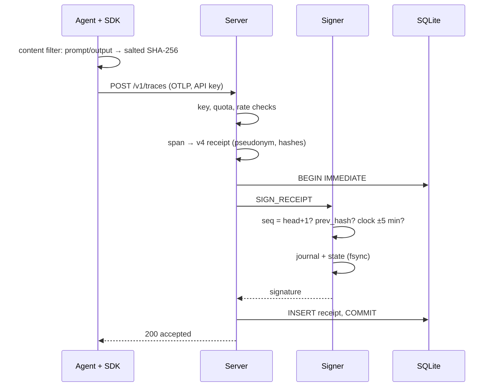

# Flow: agent action → receipt

```mermaid
sequenceDiagram
  participant A as Agent + SDK
  participant S as Server
  participant G as Signer
  participant D as SQLite
  A->>A: content filter: prompt/output → salted SHA-256
  A->>S: POST /v1/traces (OTLP, API key)
  S->>S: key, quota, rate checks
  S->>S: span → v4 receipt (pseudonym, hashes)
  S->>D: BEGIN IMMEDIATE
  S->>G: SIGN_RECEIPT
  G->>G: seq = head+1? prev_hash? clock ±5 min?
  G->>G: journal + state (fsync)
  G-->>S: signature
  S->>D: INSERT receipt, COMMIT
  S-->>A: 200 accepted
```

Notes: [[Python SDK]], [[Ingest - OTLP traces]], [[Signer]], [[Database]], [[Receipt]]. If the signer refuses or is down → 503 and nothing is stored.
