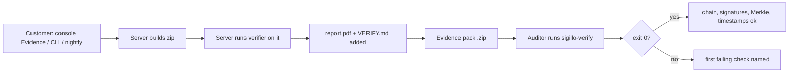

# Flow: export and verification

```mermaid
flowchart LR
  U[Customer: console Evidence / CLI / nightly] --> E[Server builds zip]
  E --> V1[Server runs verifier on it]
  V1 --> R[report.pdf + VERIFY.md added]
  R --> Z[Evidence pack .zip]
  Z --> A[Auditor runs sigillo-verify]
  A --> O{exit 0?}
  O -- yes --> OK[chain, signatures, Merkle, timestamps ok]
  O -- no --> KO[first failing check named]
```
Then optionally `doc` (which receipts used a file) and `open` (prove an input/output text). See [[Evidence pack]], [[Verifier]].
