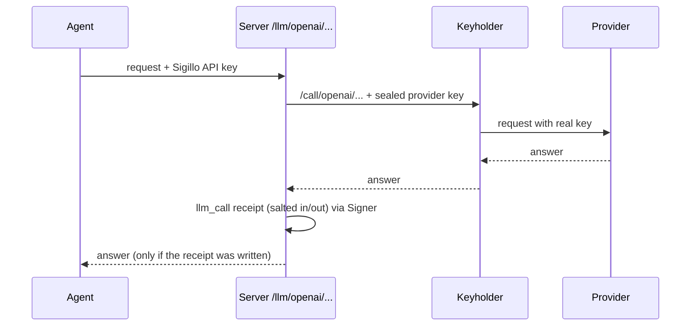

# Flow: model call through the gateway

```mermaid
sequenceDiagram
  participant A as Agent
  participant S as Server /llm/openai/...
  participant K as Keyholder
  participant P as Provider
  A->>S: request + Sigillo API key
  S->>K: /call/openai/... + sealed provider key
  K->>P: request with real key
  P-->>K: answer
  K-->>S: answer
  S->>S: llm_call receipt (salted in/out) via Signer
  S-->>A: answer (only if the receipt was written)
```
Tool requests in the answer → `model_requested.<tool>` → [[Tool reconciler]]. See [[LLM gateway]], [[Keyholder]].
