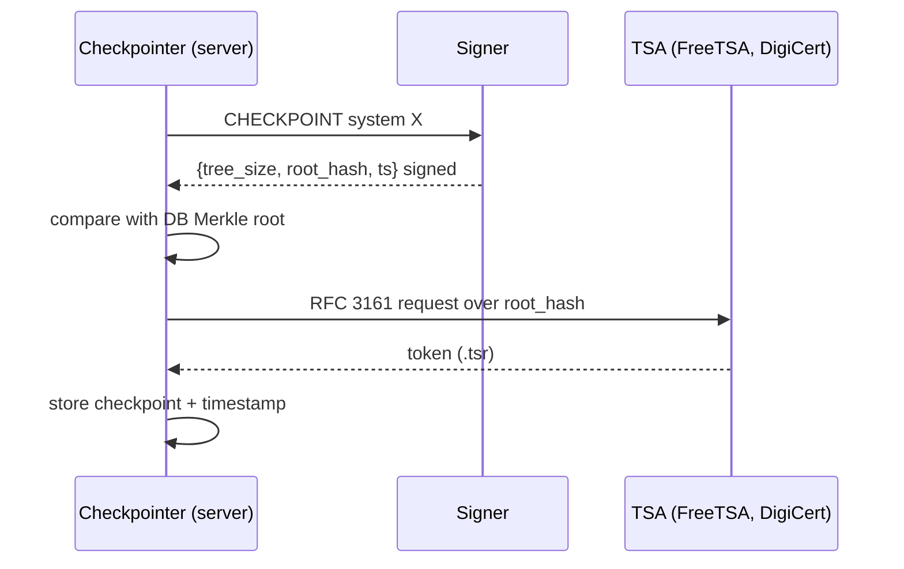

# Flow: hourly seal

```mermaid
sequenceDiagram
  participant C as Checkpointer (server)
  participant G as Signer
  participant T as TSA (FreeTSA, DigiCert)
  C->>G: CHECKPOINT system X
  G-->>C: {tree_size, root_hash, ts} signed
  C->>C: compare with DB Merkle root
  C->>T: RFC 3161 request over root_hash
  T-->>C: token (.tsr)
  C->>C: store checkpoint + timestamp
```
See [[Checkpointer]], [[Checkpoint]], [[Timestamp]], [[Anchoring]].
